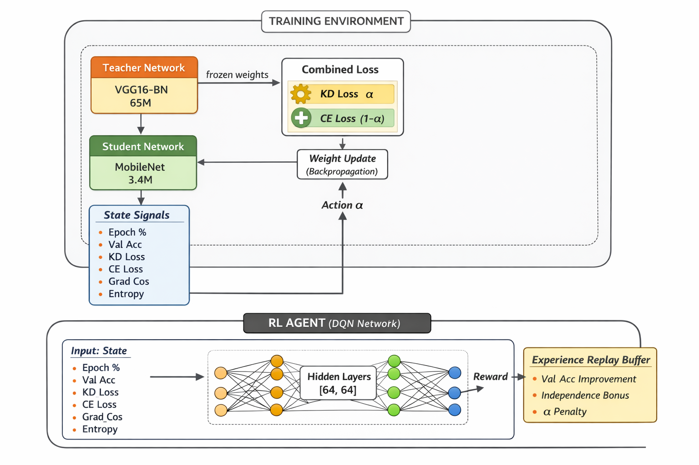

# Adaptive Knowledge Distillation via Reinforcement Learning

> Replacing fixed distillation hyperparameters with a learned DQN policy for dynamic, layer-aware model compression.


---

## Overview

Standard Knowledge Distillation (KD) transfers knowledge from a large **teacher** model to a compact **student** model using a fixed scalar α to balance soft-label and hard-label losses. This scalar is static — it treats every layer, every sample, and every training stage identically.

This project replaces that fixed α with a **DQN-based RL agent** that dynamically adapts the distillation strategy during training. The agent observes the training state at each step and decides how to modulate the knowledge transfer — allowing the student to learn more independently as it matures, rather than remaining over-reliant on the teacher throughout.

The goal: **maximum compression with minimum accuracy loss**, producing models small enough to deploy on edge devices like NVIDIA Jetson and Raspberry Pi.

---

## Architecture


*Figure: RL-driven KD framework — the DQN agent observes a 6-dimensional state vector and outputs a distillation policy that modulates teacher-student knowledge transfer at each training step.*


---

## Key Idea

```
Traditional KD:   Loss = α · KL(T || S) + (1 - α) · CrossEntropy(S, labels)
                         └─ fixed scalar, set once before training

This work:        Loss = α_t · KL(T || S) + (1 - α_t) · CrossEntropy(S, labels)
                         └─ α_t learned by DQN agent at each timestep t
```

The RL agent receives a **6-dimensional state vector** encoding:
- Epoch % (training progress)
- Val Acc (student validation accuracy)
- KD Loss (knowledge distillation loss)
- CE Loss (cross-entropy loss)
- Grad_Cos (gradient cosine similarity between teacher and student)
- Entropy (student prediction entropy)

And outputs an action that adjusts α_t — effectively deciding *how much* the student should lean on the teacher at each moment.

The **reward signal** has three components:
- **Val Acc Improvement** — primary signal for distillation quality
- **Independence Bonus** — incentivizes the student to rely less on the teacher over time
- **α Penalty** — discourages unnecessarily high dependence on soft labels

---

## Models

| Role     | Architecture  | Parameters | CIFAR-10 Accuracy |
|----------|---------------|------------|-------------------|
| Teacher  | VGG16-BN      | ~65M       | 93.49%            |
| Student  | MobileNetV2   | ~3.4M      | **92.24%**        |

> **20× parameter reduction** with less than **1.3% accuracy drop** on CIFAR-10.

---

## Results

### CIFAR-10

| Method                        | Student Accuracy |
|-------------------------------|-----------------|
| Baseline (no distillation)    | ~89.1%          |
| Standard KD (fixed α)         | ~91.3%          |
| KD + Optuna TPE               | ~91.8%          |
| KD + Ax Bayesian Optimization | ~92.24%         |
| **KD + RL Agent (DQN)**       |  *In progress* |

### Tiny-ImageNet
 *Benchmarking in progress — results to be updated.*

---

## Motivation & Applications

Large AI models are powerful but expensive to deploy. A compressed model that fits on a $50 edge device unlocks applications that were previously gated behind cloud infrastructure:

-  **Autonomous vehicles** — real-time inference without cloud round-trips
-  **Precision agriculture** — crop disease detection on field devices
-  **Medical diagnostics** — portable diagnostic tools in low-resource clinics
-  **Smart surveillance** — on-device threat detection without data egress
-  **Disaster response** — offline-capable AI in connectivity-limited zones

---

## Methodology

```
1. Train teacher model (VGG16-BN) to convergence on CIFAR-10
2. Initialize student model (MobileNetV2) with random weights
3. Initialize DQN agent with 6-dim state space
4. At each training step:
   a. Observe state vector from current training dynamics
   b. Agent selects α_t via ε-greedy policy
   c. Compute combined distillation loss using α_t
   d. Update student weights via backprop
   e. Compute reward (validation accuracy delta)
   f. Update DQN replay buffer and train agent
5. Evaluate compressed student on held-out test set
```

---

## AutoML Comparison

Prior to the RL framework, multiple hyperparameter optimization strategies were evaluated for KD:

| Strategy               | Description                                      |
|------------------------|--------------------------------------------------|
| Manual baseline        | Fixed α = 0.5, T = 4                            |
| Grid Search            | Exhaustive sweep over α and temperature T        |
| Optuna TPE             | Tree-structured Parzen Estimator                 |
| Ax Bayesian Optimization | Gaussian Process-based BO (best static result) |
| **DQN Agent (this work)** | Dynamic, state-conditioned policy            |

---

## Tech Stack

- **Framework:** PyTorch
- **Models:** torchvision (VGG16-BN, MobileNetV2)
- **RL:** Custom DQN implementation
- **HPO:** Ax Platform, Optuna
- **Datasets:** CIFAR-10, Tiny-ImageNet
- **Hardware:** Local GPU + Kaggle (T4/P100)

---

## Repo Structure

```
 adaptive-kd-rl/
├──  assets/              # Figures and architecture diagrams
├──  models/              # Teacher and student model definitions
├──  distillation/        # KD loss functions and training loop
├──  rl_agent/            # DQN agent, replay buffer, reward shaping
├──  hpo/                 # Optuna and Ax experiment configs
├──  experiments/         # Training logs and result CSVs
├──  notebooks/           # Exploratory analysis and visualizations
├── train.py                # Main training entry point
├── evaluate.py             # Evaluation and benchmarking script
└── README.md
```

> *Code is currently private. Will be open-sourced upon paper submission.*

---

## Status

- [x] Teacher model trained and validated (CIFAR-10)
- [x] Standard KD baseline established
- [x] AutoML comparison (Optuna TPE, Ax BO, Grid Search)
- [x] DQN agent architecture designed (6-dim state vector)
- [ ] RL training loop — in progress
- [ ] Tiny-ImageNet benchmarks — upcoming
- [ ] Paper writeup — planned

---

## About

This research is being conducted at **Vidyashilp University, Bangalore**, under faculty supervision in the Deep Learning Research Lab, as part of independent research into efficient AI for edge deployment.

**Pruthviraj Shinde **
B.Tech Computer Science & Data Science (with Finance minor), Year 3

🔗 *[LinkedIn — https://www.linkedin.com/in/pruthviraj-shinde-32027728a/*

---

## Citation

If you find this work useful, please consider citing it once published. BibTeX entry will be added upon paper submission.

---

*This project is part of a broader initiative to make AI deployment accessible in resource-constrained environments, particularly in the Global South.*
